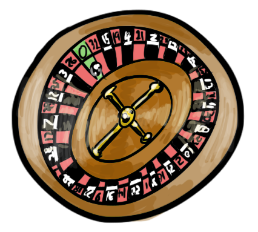

## Downtime Roulette

Picture a roulette wheel in a casino, where any particular number has a 1 in 37 chance of being hit. Imagine you could place a single bet that a given number will *not* hit (about 97.3% in your favor), and winning would pay out 10 times your wager. Would you make that bet? I'd reach for my wallet so fast my thumb would start a fire on my pocket.

Now imagine you could bet again, but only win if the wheel made a sequential 100 spins in your favor, otherwise you lose. Would you still play? Winning a single bet might be easy, but over many trials the odds are not in your favor.

People make these sorts of bets with data all of the time. A single server has a good chance of remaining available. When you run a cluster with thousands of servers, or billions of requests, the odds of any one breaking down becomes the rule.

A once-in-a-million disaster is commonplace in light of a billion opportunities.
