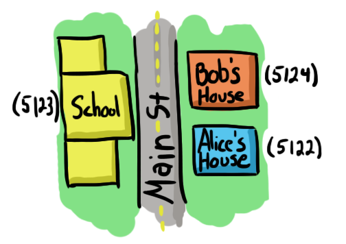

## Riak Components

Riak is a Key/Value (KV) database, built from the ground up to safely distribute data across a cluster of physical servers, called nodes. A Riak cluster is also known as a ring (we'll cover why later).

<!-- For now, we'll only consider the concepts required to be a Riak users, and cover operations later. -->

Riak functions similarly to a very large hash space. Depending on your background, you may call it hashtable, a map, a dictionary, or an object. But the idea is the same: you store a value with an immutable key, and retrieve it later.

### Key and Value



Key/value is the most basic construct in all of computerdom. You can think of a key like a home address, such as Alice's house with the unique key 5124, while the value would be maybe Alice (and her stuff).

```lisp
> (set house `(#("5124" "Alice")))
(#("5124" "Alice"))
```

Retrieving Alice is as easy as going to her house.

```lfe
> (set alice (proplists:get_value "5124" house))
"Alice"
```

Let's say that poor old Alice dies, and Bob moves into this house. The address remains the same, but the contents have changed.

```lfe
> (set house `(#("5124" "Bob")))
(#("5124" "Bob"))
```

Successive requests for `5124` will now return `Bob`:

```lfe
> (proplists:get_value "5124" house)
"Bob"
```

### Buckets

<!-- image: address streets metaphore -->

Addresses in Riakville are more than a house number, but also a street. There could be another 5124 on another street, so the way we can ensure a unique address is by requiring both, as in *5124 Main Street*.

*Buckets* in Riak are analogous to street names: they provide logical [namespaces](http://en.wikipedia.org/wiki/Namespace) so that identical keys in different buckets will not conflict.

For example, while Carol may live at *5122 Main Street*, there may be a gas station at *5122 Bagshot Row*. This would be like two different proplists:

```lfe
> (set main `(#("5122" "Carol")))
(#("5122" "Carol"))
> (set bagshot `(#("5122" "Gas")))
(#("5122" "Gas"))
```

Certainly you could have just named your keys `main_5122` and `bagshot_5122`, but buckets allow for cleaner key naming, and have other benefits, such as custom properties. For example, to add new Riak Search 2.0 indexes to a bucket, you might tell Riak to index all values under a bucket.

Buckets are so useful in Riak that all keys must belong to a bucket. There is no global namespace. The true definition of a unique key in Riak is actually `bucket/key`.

### Bucket Types

Starting in Riak 2.0, there now exists a level above buckets, called bucket types. Bucket types are groups of buckets with a similar set of properties. So for the example above, it would be like a bucket of keys:

```javascript
places["main"]["5122"] = "Alice"
places["bagshot"]["5122"] = "Gas"
```

The benefit here is that a group of distinct buckets can share properties.

```javascript
places.props = {"search_index":"anyplace"}
```

This has practical implications. Previously, you were limited to how many custom bucket properties Riak could support, because any slight change from the default would have to be propogated to every other node in the cluster (via the gossip protocol). If you had ten thousand custom buckets, that's ten thousand values that were routinely sent amongst every member. Quickly, your system could be overloaded with that chatter, called a *gossip storm*.

With the addition of bucket types, and the improved communication mechanism that accompanies it, there's no limit to your bucket count. It also makes managing multiple buckets easier, since every bucket of a type inherits the common properties, you can make across-the-board changes trivially.

Due to its versatility (and downright necessity in some cases) and improved performance, Basho recommends using bucket types whenever possible from this point into the future.

For convenience, we call a *type/bucket/key + value* pair an *object*, sparing ourselves the verbosity of "X key in the Y bucket with the Z type, and its value".
