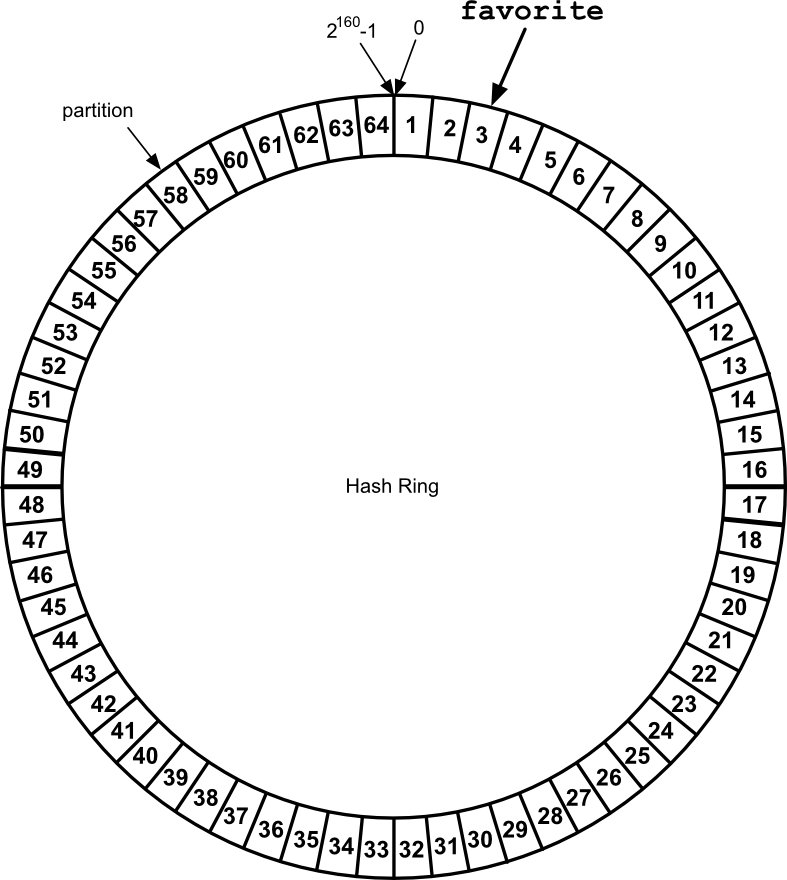

## Replication and Partitions

Distributing data across several nodes is how Riak is able to remain highly available, tolerating outages and network partitions. Riak combines two styles of distribution to achieve this: [replication](http://en.wikipedia.org/wiki/Replication) and [partitions](http://en.wikipedia.org/wiki/Partition).

### Replication

**Replication** is the act of duplicating data across multiple servers. Riak replicates by default.

The obvious benefit of replication is that if one node goes down, nodes that contain replicated data remain available to serve requests. In other words, the system remains *available*.

For example, imagine you have a list of country keys, whose values are those countries' capitals. If all you do is replicate that data to 2 servers, you would have 2 duplicate databases.

The downside with replication is that you are multiplying the amount of storage required for every duplicate. There is also some network overhead with this approach, since values must also be routed to all replicated nodes on write. But there is a more insidious problem with this approach, which I will cover shortly.

### Partitions

A **partition** is how we divide a set of keys onto separate  physical servers. Rather than duplicate values, we pick one server to exclusively host a range of keys, and the other servers to host remaining non-overlapping ranges.

With partitioning, our total capacity can increase without any big expensive hardware, just lots of cheap commodity servers. If we decided to partition our database into 1000 parts across 1000 nodes, we have (hypothetically) reduced the amount of work any particular server must do to 1/1000th.

For example, if we partition our countries into 2 servers, we might put all countries beginning with letters A-N into Node A, and O-Z into Node B.

There is a bit of overhead to the partition approach. Some service must keep track of what range of values live on which node. A requesting application must know that the key `Spain` will be routed to Node B, not Node A.

There's also another downside. Unlike replication, simple partitioning of data actually *decreases* uptime. If one node goes down, that entire partition of data is unavailable. This is why Riak uses both replication and partitioning.

### Replication+Partitions

Since partitions allow us to increase capacity, and replication improves availability, Riak combines them. We partition data across multiple nodes, as well as replicate that data into multiple nodes.

Where our previous example partitioned data into 2 nodes, we can replicate each of those partitions into 2 more nodes, for a total of 4.

Our server count has increased, but so has our capacity and reliability. If you're designing a horizontally scalable system by partitioning data, you must deal with replicating those partitions.

The Riak team suggests a minimum of 5 nodes for a Riak cluster, and replicating to 3 nodes (this setting is called `n_val`, for the number of *nodes* on which to replicate each object).

<!-- If the odds of a node going down on any day is 1%, then the odds of any server going down each day when you have 100 of them is about (1-(0.99^100)) 63%. For sufficiently large systems, servers going down are no longer edge-cases. They become regular cases that must be planned for, and designed into your system.
-->

### The Ring

Riak applies *consistent hashing* to map objects along the edge of a circle (the ring).

Riak partitions are not mapped alphabetically (as we used in the examples above), but instead a partition marks a range of key hashes (SHA-1 function applied to a key). The maximum hash value is 2^160, and divided into some number of partitions---64 partitions by default (the Riak config setting is `ring_creation_size`).

Let's walk through what all that means. If you have the key `favorite`, applying the SHA-1 algorithm would return `7501 7a36 ec07 fd4c 377a 0d2a 0114 00ab 193e 61db` in hexadecimal. With 64 partitions, each has 1/64 of the `2^160` possible values, making the first partition range from 0 to `2^154-1`, the second range is `2^154` to `2*2^154-1`, and so on, up to the last partition `63*2^154-1` to `2^160-1`.

<!-- V=lists:sum([lists:nth(X, H)*math:pow(16, X-1) || X <- lists:seq(1,string:len(H))]) / 64. -->
<!-- V / 2.28359630832954E46. // 2.2.. is 2^154 -->

We won't do all of the math, but trust me when I say `favorite` falls within the range of partition 3.

If we visualize our 64 partitions as a ring, `favorite` falls here.

"Didn't he say that Riak suggests a minimum of 5 nodes? How can we put 64 partitions on 5 nodes?" We just give each node more than one partition, each of which is managed by a *vnode*, or *virtual node*.

We count around the ring of vnodes in order, assigning each node to the next available vnode, until all vnodes are accounted for. So partition/vnode 1 would be owned by Node A, vnode 2 owned by Node B, up to vnode 5 owned by Node E. Then we continue by giving Node A vnode 6, Node B vnode 7, and so on, until our vnodes have been exhausted, leaving us this list.

* A = [1,6,11,16,21,26,31,36,41,46,51,56,61]
* B = [2,7,12,17,22,27,32,37,42,47,52,57,62]
* C = [3,8,13,18,23,28,33,38,43,48,53,58,63]
* D = [4,9,14,19,24,29,34,39,44,49,54,59,64]
* E = [5,10,15,20,25,30,35,40,45,50,55,60]

So far we've partitioned the ring, but what about replication? When we write a new value to Riak, it will replicate the result in some number of nodes, defined by a setting called `n_val`. In our 5 node cluster it defaults to 3.

So when we write our `favorite` object to vnode 3, it will be replicated to vnodes 4 and 5. This places the object in physical nodes C, D, and E. Once the write is complete, even if node C crashes, the value is still available on 2 other nodes. This is the secret of Riak's high availability.

We can visualize the Ring with its vnodes, managing nodes, and where `favorite` will go.

The Ring is more than just a circular array of hash partitions. It's also a system of metadata that gets copied to every node. Each node is aware of every other node in the cluster, which nodes own which vnodes, and other system data.

Armed with this information, requests for data can target any node. It will horizontally access data from the proper nodes, and return the result.
