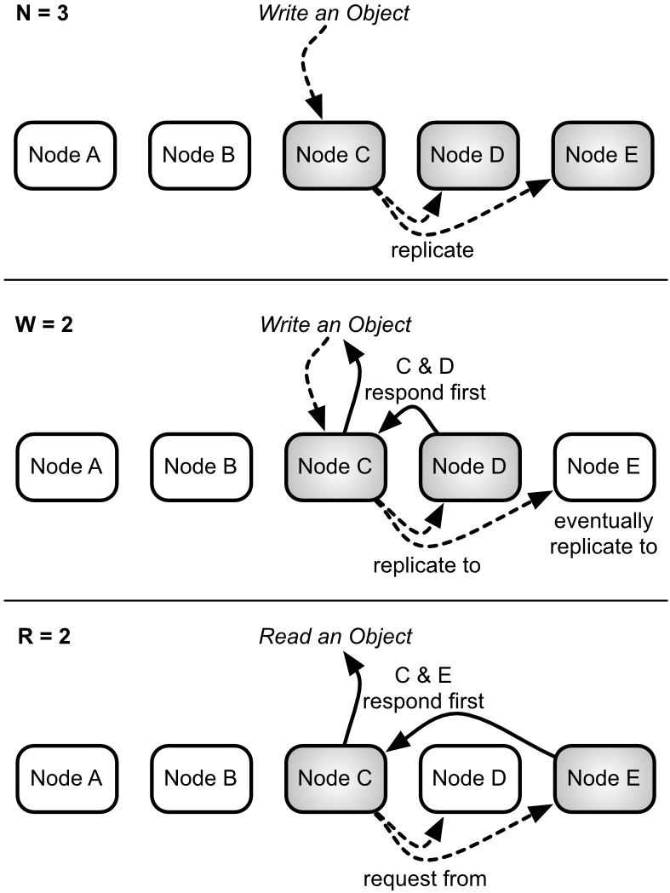

## Practical Tradeoffs

So far we've covered the good parts of partitioning and replication: highly available when responding to requests, and inexpensive capacity scaling on commodity hardware. With the clear benefits of horizontal scaling, why is it not more common?

### CAP Theorem

Classic RDBMS databases are *write consistent*. Once a write is confirmed, successive reads are guaranteed to return the newest value. If I save the value `cold pizza` to my key `favorite`, every future read will consistently return `cold pizza` until I change it.

<!-- The very act of placing our data in multiple servers carries some inherent risk. -->

But when values are distributed, *consistency* might not be guaranteed. In the middle of an object's replication, two servers could have different results. When we update `favorite` to `cold pizza` on one node, another node might contain the older value `pizza`, because of a network connectivity problem. If you request the value of `favorite` on either side of a network partition, two different results could possibly be returned---the database is inconsistent.

If consistency should not be compromised in a distributed database, we can choose to sacrifice *availability* instead. We may, for instance, decide to lock the entire database during a write, and simply refuse to serve requests until that value has been replicated to all relevant nodes. Clients have to wait while their results can be brought into a consistent state (ensuring all replicas will return the same value) or fail if the nodes have trouble communicating. For many high-traffic read/write use-cases, like an online shopping cart where even minor delays will cause people to just shop elsewhere, this is not an acceptable sacrifice.

This tradeoff is known as Brewer's CAP theorem. CAP loosely states that you can have a C (consistent), A (available), or P (partition-tolerant) system, but you can only choose 2. Assuming your system is distributed, you're going to be partition-tolerant, meaning, that your network can tolerate packet loss. If a network partition occurs between nodes, your servers still run. So your only real choices are CP or AP. Riak 2.0 supports both modes.

<!-- A fourth concept not covered by the CAP theorem, latency, is especially important here. -->

### Strong Consistency

Since version 2.0, Riak now supports strong Consistency (SC), as well as High Availability (HA). "Waitaminute!" I hear you say, "doesn't that break the CAP theorem?" Not the way Riak does it. Riak supports setting a bucket type property as strongly consistent. Any bucket of that type is now SC. Meaning, that a request is either successfully replicated to a majority of partitions, or it fails (if you want to sound fancy at parties, just say "Riak SC uses a variant of the vertical Paxos leader election algorithm").

This, naturally, comes at a cost. As we know from the CAP theorem, if too many nodes are down, the write will fail. You'll have to repair your node or network, and try the write again. In short, you've lost high availability. If you don't absolutely need strong consistency, consider staying with the high availability default, and tuning it to your needs as we'll see in the next section.


### Tunable Availability with N/R/W

A question the CAP theorem demands you answer with a distributed system is: do I give up strong consistency, or give up ensured availability? If a request comes in, do I lock out requests until I can enforce consistency across the nodes? Or do I serve requests at all costs, with the caveat that the database may become inconsistent?

Riak's solution is based on Amazon Dynamo's novel approach of a *tunable* AP system. It takes advantage of the fact that, though the CAP theorem is true, you can choose what kind of tradeoffs you're willing to make. Riak is highly available to serve requests, with the ability to tune its level of availability---nearing, but never quite reaching, strong consistency. If you want strong consistency, you'll need to create a special SC bucket type, which we'll see in a later chapter.

<blockquote>
<h3>Aside: Not Quite C</h3>

Strictly speaking, altering R and W values actually creates a tunable availability/latency tradeoff, rather than availability/consistency. Making Riak run faster by keeping R and W values low will increase the likelihood of temporarily inconsistent results (higher availability). Setting those values higher will improve the <em>odds</em> of consistent responses (never quite reaching strong consistency), but will slow down those responses and increase the likelihood that Riak will fail to respond (in the event of a partition).
</blockquote>

Riak allows you to choose how many nodes you want to replicate an object to, and how many nodes must be written to or read from per request. These values are settings labeled `n_val` (the number of nodes to replicate to), `r` (the number of nodes read from before returning), and `w` (the number of nodes written to before considered successful).

A thought experiment may help clarify things.



#### N

With our 5 node cluster, having an `n_val=3` means values will eventually replicate to 3 nodes, as we've discussed above. This is the *N value*. You can set other values (R,W) to equal the `n_val` number with the shorthand `all`.

#### W

But you may not wish to wait for all nodes to be written to before returning. You can choose to wait for all 3 to finish writing (`w=3` or `w=all`), which means my values are more likely to be consistent. Or you could choose to wait for only 1 complete write (`w=1`), and allow the remaining 2 nodes to write asynchronously, which returns a response quicker but increases the odds of reading an inconsistent value in the short term. This is the *W value*.

In other words, setting `w=all` would help ensure your system was more likely to be consistent, at the expense of waiting longer, with a chance that your write would fail if fewer than 3 nodes were available (meaning, over half of your total servers are down).

A failed write, however, is not necessarily a true failure. The client will receive an error message, but the write will typically still have succeeded on some number of nodes smaller than the *W* value, and will typically eventually be propagated to all of the nodes that should have it.

#### R

Reading involves similar tradeoffs. To ensure you have the most recent value, you can read from all 3 nodes containing objects (`r=all`). Even if only 1 of 3 nodes has the most recent value, we can compare all nodes against each other and choose the latest one, thus ensuring some consistency. Remember when I mentioned that RDBMS databases were *write consistent*? This is close to *read consistency*. Just like `w=all`, however, the read will fail unless 3 nodes are available to be read. Finally, if you only want to quickly read any value, `r=1` has low latency, and is likely consistent if `w=all`.

In general terms, the N/R/W values are Riak's way of allowing you to trade lower consistency for more availability.

### Logical Clock

If you've followed thus far, I only have one more conceptual wrench to throw at you. I wrote earlier that with `r=all`, we can "compare all nodes against each other and choose the latest one." But how do we know which is the latest value? This is where logical clocks like *vector clocks* (aka *vclocks*) come into play.

<blockquote>
<h3>Aside: DVV</h3>

Since Riak 2.0, some internal values have been migrated over to an alternative logical timestamp called Dot Version Vectors (DVV). How they operate isn't germain to this short lesson, but rather, what is important is basic idea of a logical clock. You can read more about DVVs (or any Riak concept) on the [Basho docs website](http://docs.basho.com).
</blockquote>

Vector clocks measure a sequence of events, just like a normal clock. But since we can't reasonably keep the clocks on dozens, or hundreds, or thousands of servers in sync (without really exotic hardware, like geosynchronized atomic clocks, or quantum entanglement), we instead keep a running history of updates, and look for logical, rather than temporal, causality.

Let's use our `favorite` example again, but this time we have 3 people trying to come to a consensus on their favorite food: Aaron, Britney, and Carrie. These people are called *actors*, ie. the things responsible for the updates. We'll track the value each actor has chosen along with the relevant vector clock.

(To illustrate vector clocks in action, we're cheating a bit. Riak doesn't track vector clocks via the client that initiated the request, but rather, via the server that coordinates the write request; nonetheless, the concept is the same. We'll cheat further by disregarding the timestamp that is stored with vector clocks.)

When Aaron sets the `favorite` object to `pizza`, a vector clock could contain his name and the number of updates he's performed.

```yaml
bucket: food
key:    favorite

vclock: {Aaron: 1}
value:  pizza
```

Britney now comes along, and reads `favorite`, but decides to update `pizza` to `cold pizza`. When using vclocks, she must provide the vclock returned from the request she wants to update. This is how Riak can help ensure you're updating a previous value, and not merely overwriting with your own.

```yaml
bucket: food
key:    favorite

vclock: {Aaron: 1, Britney: 1}
value:  cold pizza
```

At the same time as Britney, Carrie decides that pizza was a terrible choice, and tried to change the value to `lasagna`.

```yaml
bucket: food
key:    favorite

vclock: {Aaron: 1, Carrie: 1}
value:  lasagna
```

This presents a problem, because there are now two vector clocks in play that diverge from `{Aaron: 1}`. By default, Riak will store both values.

Later in the day Britney checks again, but this time she gets the two conflicting values (aka *siblings*, which we'll discuss in more detail in the next chapter), with two vclocks.

```yaml
bucket: food
key:    favorite

vclock: {Aaron: 1, Britney: 1}
value:  cold pizza
---
vclock: {Aaron: 1, Carrie: 1}
value:  lasagna
```

It's clear that a decision must be made. Perhaps Britney knows that Aaron's original request was for `pizza`, and thus two people generally agreed on `pizza`, so she resolves the conflict choosing that and providing a new vclock.

```yaml
bucket: food
key:    favorite

vclock: {Aaron: 1, Carrie: 1, Britney: 2}
value:  pizza
```

Now we are back to the simple case, where requesting the value of `favorite` will just return the agreed upon `pizza`.

If you're a programmer, you may notice that this is not unlike a version control system, like **git**, where conflicting branches may require manual merging into one.

### Datatypes

New in Riak 2.0 is the concept of datatypes. In the preceding logical clock example, we were responsible for resolving the conflicting values. This is because in the normal case, Riak has no idea what object's you're giving it. That is to say, Riak values are *opaque*. This is actually a powerful construct, since it allows you to store any type of value you want, from plain text, to semi-structured data like XML or JSON, to binary objects like images.

When you decide to use datatypes, you've given Riak some information about the type of object you want to store. With this information, Riak can figure out how to resolve conflicts automatically for you, based on some pre-defined behavior.

Let's try another example. Let's imagine a shopping cart in an online retailer. You can imagine a shopping cart like a set of items. So each key in our cart contains a *set* of values.

Let's say you log into the retailer's website on your laptop with your username *ponies4evr*, and choose the Season 2 DVD of *My Little Pony: Friendship is Magic*. This time, the logical clock will act more like Riak's, where the node that coordinates the request will be the actor.

```yaml
type:   set
bucket: cart
key:    ponies4evr

vclock: {Node_A: 1}
value:  ["MYPFIM-S2-DVD"]
```

Once the DVD was added to the cart bucket, your laptop runs out of batteries. So you take out your trusty smartphone, and log into the retailer's mobile app. You decide to also add the *Bloodsport III* DVD. Little did you know, a temporary network partition caused your write to redirect to another node. This partition had no knowledge of your other purchase.

```yaml
type:   set
bucket: cart
key:    ponies4evr

vclock: {Node_B: 1}
value:  ["BS-III-DVD"]
```

Happily, the network hiccup was temporary, and thus the cluster heals itself. Under normal circumstances, since the logical clocks did not descend from one another, you'd end up with siblings like this:

```yaml
type:   set
bucket: cart
key:    ponies4evr

vclock: {Node_A: 1}
value:  ["MYPFIM-S2-DVD"]
---
vclock: {Node_B: 1}
value:  ["BS-III-DVD"]
```

But since the bucket was designed to hold a *set*, Riak knows how to automatically resolve this conflict. In the case of conflicting sets, it performs a set union. So when you go to checkout of the cart, the system returns this instead:

```yaml
type:   set
bucket: cart
key:    ponies4evr

vclock: [{Node_A: 1}, {Node_B: 1}]
value:  ["MYPFIM-S2-DVD", "BS-III-DVD"]
```

Datatypes will never return conflicts. This is an important claim to make, because as a developer, you get all of the benefits of dealing with a simple value, with all of the benefits of a distributed, available system. You don't have to think about handling conflicts. It would be like a version control system where (*git*, *svn*, etc) where you never had to merge code---the VCS simply *knew* what you wanted.

How this all works is beyond the scope of this document. Under the covers it's implemented by something called [CRDTs](http://docs.basho.com/riak/2.0.0/theory/concepts/crdts/) \(Conflict-free Replicated Data Types). What's important to note is that Riak supports four datatypes: *map*, *set*, *counter*, *flag* (a boolean value). Best of all, maps can nest arbitrarily, so you can create a map whose values are sets, counters, or even other maps. It also supports plain string values called *register*s.

We'll see how to use datatypes in the next chapter.

### Riak and ACID

<blockquote>
<h3>Aside: Distributed Relational is Not Exempt</h3>

So why don't we just distribute a standard relational database? MySQL has the ability to cluster, and it's ACID (<em>Atomic</em>, *Consistent*, *Isolated*, *Durable*), right? Yes and no.

A single node in the cluster is ACID, but the entire cluster is not without a loss of availability and (often worse) increased latency. When you write to a primary node, and a secondary node is replicated to, a network partition can occur. To remain available, the secondary will not be in sync (eventually consistent). Have you ever loaded from a backup on database failure, but the dataset was incomplete by a few hours? Same idea.

Or, the entire transaction can fail, making the whole cluster unavailable. Even ACID databases cannot escape the scourge of CAP.
</blockquote>

Unlike single node databases like Neo4j or PostgreSQL, Riak does not support *ACID* transactions. Locking across multiple servers would can write availability, and equally concerning, increase latency. While ACID transactions promise *Atomicity*, *Consistency*, *Isolation*, and *Durability*---Riak and other NoSQL databases follow *BASE*, or *Basically Available*, *Soft state*, *Eventually consistent*.

The BASE acronym was meant as shorthand for the goals of non-ACID-transactional databases like Riak. It is an acceptance that distribution is never perfect (basically available), all data is in flux (soft state), and that strong consistency is untenable (eventually consistent) if you want high availability.

Look closely at promises of distributed transactions---it's often couched in some diminishing adjective or caveat like *row transactions*, or *per node transactions*, which basically mean *not transactional* in terms you would normally use to define it. I'm not claiming it's impossible, but certainly worth due consideration.

As your server count grows---especially as you introduce multiple datacenters---the odds of partitions and node failures drastically increase. My best advice is to design for it upfront.
