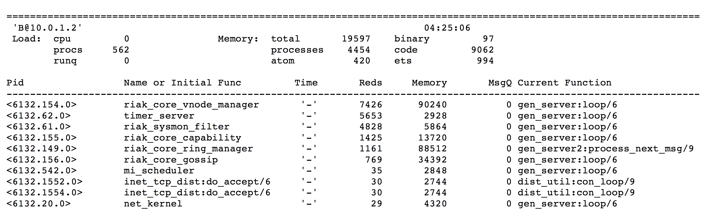

## Managing a Cluster

Now that we have a grasp of the general concepts of Riak, how users query it,
and how Riak manages replication, it's time to build a cluster. It's so easy to
do, in fact, I didn't bother discussing it for most of this book.

### Install

The Riak docs have all of the information you need to [install](http://docs.basho.com/riak/latest/tutorials/installation/) it per operating system. The general sequence is:

1. Install Erlang
2. Get Riak from a package manager (<em>a la</em> `apt-get` or Homebrew), or build from source (the results end up under `rel/riak`, with the binaries under `bin`).
3. Run `riak start`

Install Riak on four or five nodes---five being the recommended safe minimum for production. Fewer nodes are OK during software development and testing.

### Command Line

Most Riak operations can be performed though the command line. We'll concern ourselves with two commands: `riak` and `riak-admin`.

<h4>riak</h4>

Simply typing the `riak` command will give a usage list. If you want more information, you can try `riak help`.

```bash
Usage: riak <command>
where <command> is one of the following:
    { help | start | stop | restart | ping | console | attach
      attach-direct | ertspath | chkconfig | escript | version | getpid
      top [-interval N] [-sort { reductions | memory | msg_q }] [-lines N] } |
      config { generate | effective | describe VARIABLE } [-l debug]

Run 'riak help' for more detailed information.
```

Most of these commands are self explanatory, once you know what they mean. `start` and `stop` are simple enough. `restart` means to stop the running node and restart it inside of the same Erlang VM (virtual machine), while `reboot` will take down the Erlang VM and restart everything.

You can print the current running `version`. `ping` will return `pong` if the server is in good shape, otherwise you'll get the *just-similar-enough-to-be-annoying* response `pang` (with an *a*), or a simple `Node X not responding to pings` if it's not running at all.

`chkconfig` is useful if you want to ensure your `etc/riak.conf` is not broken
(that is to say, it's parsable). I mentioned `attach` briefly above, when
we looked into the details of the Ring---it attaches a console to the local
running Riak server so you can execute Riak's Erlang code. `escript` is similar
to `attach`, except you pass in script file of commands you wish to run automatically.

<!--
If you want to build this on a single dev machine, here is a truncated guide.
Download the Riak source code, then run the following:
make deps
make devrel
for i in {1..5}; do dev/dev$i/bin/riak start; done
for i in {1..5}; do dev/dev$i/bin/riak ping; done
for i in {2..5}; do dev/dev$i/bin/riak-admin cluster join riak@AAA.cluster; done
dev/dev1/bin/riak-admin cluster plan
dev/dev1/bin/riak-admin cluster commit
You should now have a 5 node cluster running locally.
-->

#### riak-admin

The `riak-admin` command is the meat operations, the tool you'll use most often. This is where you'll join nodes to the Ring, diagnose issues, check status, and trigger backups.

```bash
Usage: riak-admin { cluster | join | leave | backup | restore | test |
                    reip | js-reload | erl-reload | wait-for-service |
                    ringready | transfers | force-remove | down |
                    cluster-info | member-status | ring-status | vnode-status |
                    aae-status | diag | status | transfer-limit | reformat-indexes |
                    top [-interval N] [-sort reductions|memory|msg_q] [-lines N] |
                    downgrade-objects | security | bucket-type | repair-2i |
                    search | services | ensemble-status }
```

For more information on commands, you can try `man riak-admin`.

A few of these commands are deprecated, and many don't make sense without a
cluster, but some we can look at now.

`status` outputs a list of information about this cluster. It's mostly the same information you can get from getting `/stats` via HTTP, although the coverage of information is not exact (for example, riak-admin status returns `disk`, and `/stats` returns some computed values like `gossip_received`).

```bash
$ riak-admin status
1-minute stats for 'riak@AAA.cluster'
-------------------------------------------
vnode_gets : 0
vnode_gets_total : 2
vnode_puts : 0
vnode_puts_total : 1
vnode_index_reads : 0
vnode_index_reads_total : 0
vnode_index_writes : 0
vnode_index_writes_total : 0
vnode_index_writes_postings : 0
vnode_index_writes_postings_total : 0
vnode_index_deletes : 0
...
```

New JavaScript or Erlang files (as we did in the [developers](#developers) chapter) are not usable by the nodes until they are informed about them by the `js-reload` or `erl-reload` command.

`riak-admin` also provides a little `test` command, so you can perform a read/write cycle
to a node, which I find useful for testing a client's ability to connect, and the node's
ability to write.

Finally, `top` is an analysis command checking the Erlang details of a particular node in
real time. Different processes have different process ids (Pids), use varying amounts of memory,
queue up so many messages at a time (MsgQ), and so on. This is useful for advanced diagnostics,
and is especially useful if you know Erlang or need help from other users, the Riak team, or
Basho.



### Making a Cluster

With several solitary nodes running---assuming they are networked and are able to communicate to
each other---launching a cluster is the simplest part.

Executing the `cluster` command will output a descriptive set of commands.

```bash
$ riak-admin cluster
The following commands stage changes to cluster membership. These commands
do not take effect immediately. After staging a set of changes, the staged
plan must be committed to take effect:

 join <node>                  Join node to the cluster containing <node>
 leave                        Have this node leave the cluster and shutdown
 leave <node>                 Have <node> leave the cluster and shutdown

 force-remove <node>          Remove <node> from the cluster without
                              first handing off data. Designed for
                              crashed, unrecoverable nodes

 replace <node1> <node2>      Have <node1> transfer all data to <node2>,
                              and then leave the cluster and shutdown

 force-replace <node1> <node2>  Reassign all partitions owned by <node1>
                              to <node2> without first handing off data,
                              and remove <node1> from the cluster.

Staging commands:
 plan                         Display the staged changes to the cluster
 commit                       Commit the staged changes
 clear                        Clear the staged changes
```

To create a new cluster, you must `join` another node (any will do). Taking a
node out of the cluster uses `leave` or `force-remove`, while swapping out
an old node for a new one uses `replace` or `force-replace`.

I should mention here that using `leave` is the nice way of taking a node
out of commission. However, you don't always get that choice. If a server
happens to explode (or simply smoke ominously), you don't need its approval
to remove it from the cluster, but can instead mark it as `down`.

But before we worry about removing nodes, let's add some first.

```bash
$ riak-admin cluster join riak@AAA.cluster
Success: staged join request for 'riak@BBB.cluster' to 'riak@AAA.cluster'
$ riak-admin cluster join riak@AAA.cluster
Success: staged join request for 'riak@CCC.cluster' to 'riak@AAA.cluster'
```

Once all changes are staged, you must review the cluster `plan`. It will give you
all of the details of the nodes that are joining the cluster, and what it
will look like after each step or *transition*, including the `member-status`,
and how the `transfers` plan to handoff partitions.

Below is a simple plan, but there are cases when Riak requires multiple
transitions to enact all of your requested actions, such as adding and removing
nodes in one stage.

```bash
$ riak-admin cluster plan
=============================== Staged Changes ==============
Action         Nodes(s)
-------------------------------------------------------------
join           'riak@BBB.cluster'
join           'riak@CCC.cluster'
-------------------------------------------------------------


NOTE: Applying these changes will result in 1 cluster transition

#############################################################
                         After cluster transition 1/1
#############################################################

================================= Membership ================
Status     Ring    Pending    Node
-------------------------------------------------------------
valid     100.0%     34.4%    'riak@AAA.cluster'
valid       0.0%     32.8%    'riak@BBB.cluster'
valid       0.0%     32.8%    'riak@CCC.cluster'
-------------------------------------------------------------
Valid:3 / Leaving:0 / Exiting:0 / Joining:0 / Down:0

WARNING: Not all replicas will be on distinct nodes

Transfers resulting from cluster changes: 42
  21 transfers from 'riak@AAA.cluster' to 'riak@CCC.cluster'
  21 transfers from 'riak@AAA.cluster' to 'riak@BBB.cluster'
```

Making changes to cluster membership can be fairly resource intensive,
so Riak defaults to only performing 2 transfers at a time. You can
choose to alter this `transfer-limit` using `riak-admin`, but bear in
mind the higher the number, the greater normal operations will be
impinged.

At this point, if you find a mistake in the plan, you have the chance to `clear` it and try
again. When you are ready, `commit` the cluster to enact the plan.

```bash
$ riak-admin cluster commit
Cluster changes committed
```

Without any data, adding a node to a cluster is a quick operation. However, with large amounts of
data to be transferred to a new node, it can take quite a while before the new node is ready to use.

### Status Options

To check on a launching node's progress, you can run the `wait-for-service` command. It will
output the status of the service and stop when it's finally up. In this example, we check
the `riak_kv` service.

```bash
$ riak-admin wait-for-service riak_kv riak@CCC.cluster
riak_kv is not up: []
riak_kv is not up: []
riak_kv is up
```

You can get a list of available services with the `services` command.

You can also see if the whole ring is ready to go with `ringready`. If the nodes do not agree
on the state of the ring, it will output `FALSE`, otherwise `TRUE`.

```bash
$ riak-admin ringready
TRUE All nodes agree on the ring ['riak@AAA.cluster','riak@BBB.cluster',
                                  'riak@CCC.cluster']
```

For a more complete view of the status of the nodes in the ring, you can check out `member-status`.

```bash
$ riak-admin member-status
================================= Membership ================
Status     Ring    Pending    Node
-------------------------------------------------------------
valid      34.4%      --      'riak@AAA.cluster'
valid      32.8%      --      'riak@BBB.cluster'
valid      32.8%      --      'riak@CCC.cluster'
-------------------------------------------------------------
Valid:3 / Leaving:0 / Exiting:0 / Joining:0 / Down:0
```

And for more details of any current handoffs or unreachable nodes, try `ring-status`. It
also lists some information from `ringready` and `transfers`. Below I turned off the C
node to show what it might look like.

```bash
$ riak-admin ring-status
================================== Claimant =================
Claimant:  'riak@AAA.cluster'
Status:     up
Ring Ready: true

============================== Ownership Handoff ============
Owner:      dev1 at 127.0.0.1
Next Owner: dev2 at 127.0.0.1

Index: 182687704666362864775460604089535377456991567872
  Waiting on: []
  Complete:   [riak_kv_vnode,riak_pipe_vnode]
...

============================== Unreachable Nodes ============
The following nodes are unreachable: ['riak@CCC.cluster']

WARNING: The cluster state will not converge until all nodes
are up. Once the above nodes come back online, convergence
will continue. If the outages are long-term or permanent, you
can either mark the nodes as down (riak-admin down NODE) or
forcibly remove the nodes from the cluster (riak-admin
force-remove NODE) to allow the remaining nodes to settle.
```

If all of the above information options about your nodes weren't enough, you can
list the status of each vnode per node, via `vnode-status`. It'll show each
vnode by its partition number, give any status information, and a count of each
vnode's keys. Finally, you'll get to see each vnode's backend type---something I'll
cover in the next section.

```bash
$ riak-admin vnode-status
Vnode status information
-------------------------------------------

VNode: 0
Backend: riak_kv_bitcask_backend
Status:
[{key_count,0},{status,[]}]

VNode: 91343852333181432387730302044767688728495783936
Backend: riak_kv_bitcask_backend
Status:
[{key_count,0},{status,[]}]

VNode: 182687704666362864775460604089535377456991567872
Backend: riak_kv_bitcask_backend
Status:
[{key_count,0},{status,[]}]

VNode: 274031556999544297163190906134303066185487351808
Backend: riak_kv_bitcask_backend
Status:
[{key_count,0},{status,[]}]

VNode: 365375409332725729550921208179070754913983135744
Backend: riak_kv_bitcask_backend
Status:
[{key_count,0},{status,[]}]
...
```

Some commands we did not cover are either deprecated in favor of their `cluster`
equivalents (`join`, `leave`, `force-remove`, `replace`, `force-replace`), or
flagged for future removal `reip` (use `cluster replace`).

I know this was a lot to digest, and probably pretty dry. Walking through command
line tools usually is. There are plenty of details behind many of the `riak-admin`
commands, too numerous to cover in such a short book. I encourage you to toy around
with them on your own installation.
