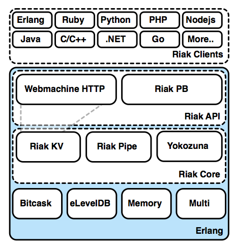
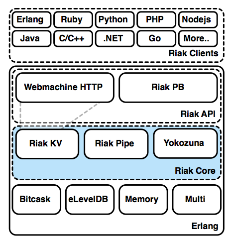
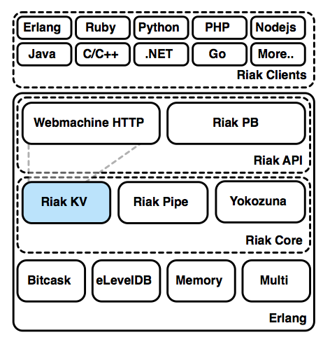
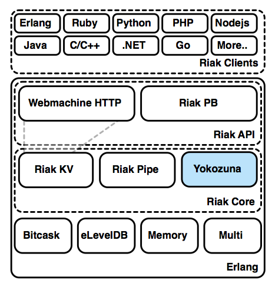
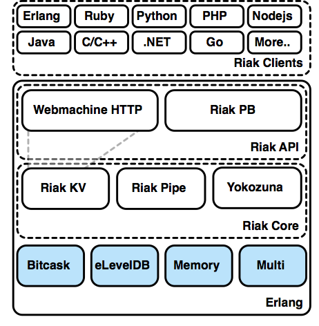
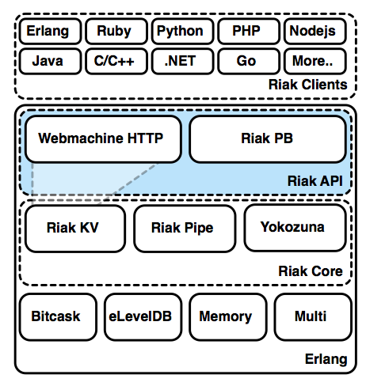

## How Riak is Built


It's difficult to label Riak as a single project. It's probably more correct to think of
Riak as the center of gravity for a whole system of projects. As we've covered
before, Riak is built on Erlang, but that's not the whole story. It's more correct
to say Riak is fundamentally Erlang, with some pluggable native C code components
(like leveldb), Java (Yokozuna), and even JavaScript (for MapReduce or commit hooks).

The way Riak stacks technologies is a good thing to keep in mind, in order to make
sense of how to configure it properly.

### Erlang



When you fire up a Riak node, it also starts up an Erlang VM (virtual machine) to run
and manage Riak's processes. These include vnodes, process messages, gossips, resource
management and more. The Erlang operating system process is found as a `beam.smp`
command with many, many arguments.

These arguments are configured through the `etc/riak.conf` file. There are a few
settings you should pay special attention to.

```bash
$ ps -o command | grep beam
/riak/erts-5.9.1/bin/beam.smp \
-K true \
-A 64 \
-W w -- \
-root /riak \
-progname riak -- \
-home /Users/ericredmond -- \
-boot /riak/releases/2.0.0/riak \
-embedded \
-config /riak/data/generated.configs/app.2014.08.15.12.38.45.config \
-pa ./lib/basho-patches \
-name riak@AAA.cluster \
-setcookie testing123 -- \
console
```

The `name` setting is the name of the current Riak node. Every node in your cluster
needs a different name. It should have the IP address or dns name of the server
this node runs on, and optionally a different prefix---though some people just like
to name it *riak* for simplicity (eg: `riak@node15.myhost`).

The `setcookie` parameter is a setting for Erlang to perform inter-process
communication (IPC) across nodes. Every node in the cluster must have the same
cookie name. I recommend you change the name from `riak` to something a little
less likely to accidentally conflict, like `hihohihoitsofftoworkwego`.

My `riak.conf` sets it's node name and cookie like this:

```bash
## Name of the Erlang node
## 
## Default: riak@127.0.0.1
## 
## Acceptable values:
##   - text
nodename = riak@AAA.cluster

## Cookie for distributed node communication.  All nodes in the
## same cluster should use the same cookie or they will not be able to
## communicate.
## 
## Default: riak
## 
## Acceptable values:
##   - text
distributed_cookie = testing123
```

Continuing down the `riak.conf` file are more Erlang settings, some environment
variables that are set up for the process (prefixed by `-env`), followed by
some optional SSL encryption settings.

### riak_core



If any single component deserves the title of "Riak proper", it would
be *Riak Core*. Core shares responsibility with projects built atop it
for managing the partitioned keyspace, launching and supervising
vnodes, preference list building, hinted handoff, and things that
aren't related specifically to client interfaces, handling requests,
or storage.

Riak Core, like any project, has some hard-coded values (for example, how
protocol buffer messages are encoded in binary). However, many values
can be modified to fit your use case. The majority of this configuration
occurs under `riak.conf`. This file is Erlang code, so commented lines
begin with a `%` character.

The `riak_core` configuration section allows you to change the options in
this project. This handles basic settings, like files/directories where
values are stored or to be written to, the number of partitions/vnodes
in the cluster (`ring_size`), and several port options.

```bash
## Default location of ringstate
ring.state_dir = $(platform_data_dir)/ring

## Number of partitions in the cluster (only valid when first
## creating the cluster). Must be a power of 2, minimum 8 and maximum
## 1024.
## 
## Default: 64
## 
## Acceptable values:
##   - an integer
ring_size = 8

## listener.http.<name> is an IP address and TCP port that the Riak
## HTTP interface will bind.
## 
## Default: 127.0.0.1:8098
## 
## Acceptable values:
##   - an IP/port pair, e.g. 127.0.0.1:8098
listener.http.internal = 0.0.0.0:8098

## listener.protobuf.<name> is an IP address and TCP port that the Riak
## Protocol Buffers interface will bind.
## 
## Default: 127.0.0.1:8087
## 
## Acceptable values:
##   - an IP/port pair, e.g. 127.0.0.1:8087
listener.protobuf.internal = 0.0.0.0:8087

## listener.https.<name> is an IP address and TCP port that the Riak
## HTTPS interface will bind.
## 
## Acceptable values:
##   - an IP/port pair, e.g. 127.0.0.1:8069
## listener.https.internal = 127.0.0.1:8069

## riak handoff_port is the TCP port that Riak uses for
## intra-cluster data handoff.
## handoff.port = 8099

## Platform-specific installation paths
## platform_bin_dir = ./bin
## platform_data_dir = ./data
## platform_etc_dir = ./etc
## platform_lib_dir = ./lib
## platform_log_dir = ./log
```

### riak_kv



Riak KV is a key/value implementation of Riak Core. This is where the
magic happens, such as handling requests and coordinating them for
redundancy and read repair. It's what makes Riak a KV store rather
than something else like a Cassandra-style columnar data store.

<!-- When configuring KV, you may scratch your head about about when a setting belongs
under `riak_kv` versus `riak_core`. For example, if `http` is under core, why
is raw_name under riak. -->

KV is so integral to the function of Riak, that it's hardly worth going over
its settings as an independent topic. Many of of the values you set in other
subsystems are used by KV in some capacity. So let's move on.

### yokozuna



Yokozuna is the newest addition to the Riak ecosystem. It's an integration of
the distributed Solr search engine into Riak, and provides some extensions
for extracting, indexing, and tagging documents. The Solr server runs its
own HTTP interface, and though your Riak users should never have to access
it, you can choose which `solr_port` will be used.

```bash
search = on
search.solr_port = 8093
```

### bitcask, eleveldb, memory, multi

Several modern databases have swappable backends, and Riak is no different in that
respect. Riak currently supports three different storage engines: *Bitcask*,
*eLevelDB*, and *Memory* --- and one hybrid called *Multi*.

Using a backend is simply a matter of setting the `storage_backend` with one of the following values.

- `bitcask` - The catchall Riak backend. If you don't have a compelling reason to *not* use it, this is my suggestion.
- `leveldb` - A Riak-friendly backend which uses a very customized version of Google's leveldb. This is necessary if you have too many keys to fit into memory, or wish to use 2i.
- `memory` - A main-memory backend, with time-to-live (TTL). Meant for transient data.
- `multi` - Any of the above backends, chosen on a per-bucket basis.


```bash
## Specifies the storage engine used for Riak's key-value data
## and secondary indexes (if supported).
## 
## Default: bitcask
## 
## Acceptable values:
##   - one of: bitcask, leveldb, memory, multi
storage_backend = memory
```

Then, with the exception of Multi, each memory configuration is under one of
the following options. TTL (time to live) is great and useful, but note, that
it's only useful if you're using Riak as a strict KV store. The backend won't
communicate to other systems (such as Search) that the value has timed out.

```bash
## Memory Config
memory.max_memory = 4GB
memory.ttl = 86400  # 1 Day in seconds
```

Bitcask is a simple soul. It's the backend of choice, and generally the most complex setting you might want to toy with is how bitcask flushes data to disk.

```bash
## A path under which bitcask data files will be stored.
## 
## Default: $(platform_data_dir)/bitcask
## 
## Acceptable values:
##   - the path to a directory
bitcask.data_root = $(platform_data_dir)/bitcask

## Configure how Bitcask writes data to disk.
## erlang: Erlang's built-in file API
## nif: Direct calls to the POSIX C API
## The NIF mode provides higher throughput for certain
## workloads, but has the potential to negatively impact
## the Erlang VM, leading to higher worst-case latencies
## and possible throughput collapse.
## 
## Default: erlang
## 
## Acceptable values:
##   - one of: erlang, nif
bitcask.io_mode = erlang
```

However, there are many, many more levers and knobs to pull and twist.

```bash
## Bitcask Config
bitcask.data_root = $(platform_data_dir)/bitcask
bitcask.expiry = off
bitcask.expiry.grace_time = 0
bitcask.fold.max_age = unlimited
bitcask.fold.max_puts = 0
bitcask.hintfile_checksums = strict
bitcask.io_mode = erlang
bitcask.max_file_size = 2GB
bitcask.max_merge_size = 100GB
bitcask.merge.policy = always
bitcask.merge.thresholds.dead_bytes = 128MB
bitcask.merge.thresholds.fragmentation = 40
bitcask.merge.thresholds.small_file = 10MB
bitcask.merge.triggers.dead_bytes = 512MB
bitcask.merge.triggers.fragmentation = 60
bitcask.merge.window.end = 23
bitcask.merge.window.start = 0
bitcask.merge_check_interval = 3m
bitcask.merge_check_jitter = 30%
bitcask.open_timeout = 4s
bitcask.sync.strategy = none
```

There are many configuration values for leveldb. But most of the time, you're best served to leave them alone. The only value you may ever want to play with is the maximum_memory percent, which defines the most system memory that leveldb will ever use.

```bash
## This parameter defines the percentage of total server memory
## to assign to LevelDB. LevelDB will dynamically adjust its internal
## cache sizes to stay within this size.  The memory size can
## alternately be assigned as a byte count via leveldb.maximum_memory
## instead.
## 
## Default: 70
## 
## Acceptable values:
##   - an integer
leveldb.maximum_memory.percent = 70
```

But, if you really want to peek into leveldb's spectrum of choices:

```bash
# LevelDB Config
leveldb.block.restart_interval = 16
leveldb.block.size = 4KB
leveldb.block.size_steps = 16
leveldb.block_cache_threshold = 32MB
leveldb.bloomfilter = on
leveldb.compaction.trigger.tombstone_count = 1000
leveldb.compression = on
leveldb.data_root = $(platform_data_dir)/leveldb
leveldb.fadvise_willneed = false
leveldb.limited_developer_mem = on
leveldb.sync_on_write = off
leveldb.threads = 71
leveldb.tiered = off
leveldb.verify_checksums = on
leveldb.verify_compaction = on
leveldb.write_buffer_size_max = 60MB
leveldb.write_buffer_size_min = 30MB
```



With the Multi backend, you can even choose different backends
for different buckets. This can make sense, as one bucket may hold
user information that you wish to index (use eleveldb), while another
bucket holds volatile session information that you may prefer to simply
remain resident (use memory).

You can set up a multi backend by adding/using an `advanced.config`
file, which lives in the riak `etc` directory alongside `riak.conf`.

```bash
%% Riak KV config
{riak_kv, [
  %% Storage_backend specifies the Erlang module defining
  %% the storage mechanism that will be used on this node.
  {storage_backend = riak_kv_multi_backend},

  %% Choose one of the names you defined below
  {multi_backend_default, <<"bitcask_multi">>},

  {multi_backend, [
    %% Heres where you set the individual backends
    {<<"bitcask_multi">>,  riak_kv_bitcask_backend, [
      %% bitcask configuration
      {config1, ConfigValue1},
      {config2, ConfigValue2}
    ]},
    {<<"memory_multi">>,   riak_kv_memory_backend, [
      %% memory configuration
      {max_memory, 8192}   %% 8GB
    ]}
  ]},
]}.
```

You can put the `memory_multi` configured above to the `session_data` bucket
by just setting its `backend` property.

```bash
$ curl -XPUT $RIAK/types/default/buckets/session_data/props \
  -H "Content-Type: application/json" \
  -d '{"props":{"backend":"memory_multi"}}'
```

### riak_api



So far, all of the components we've seen have been inside the Riak
house. The API is the front door. *In a perfect world*, the API would
manage two implementations: HTTP and Protocol buffers (PB), an
efficient binary protocol framework designed by Google.

But because they are not yet separated, only PB is configured under `riak_api`,
while HTTP still remains under KV.

In any case, Riak API represents the client facing aspect of Riak. Implementations
handle how data is encoded and transferred, and this project handles the services
for presenting those interfaces, managing connections, providing entry points.


```bash
## listener.protobuf.<name> is an IP address and TCP port that the Riak
## Protocol Buffers interface will bind.
## 
## Default: 127.0.0.1:8087
## 
## Acceptable values:
##   - an IP/port pair, e.g. 127.0.0.1:8087
listener.protobuf.internal = 0.0.0.0:8087

## The maximum length to which the queue of pending connections
## may grow. If set, it must be an integer > 0. If you anticipate a
## huge number of connections being initialized *simultaneously*, set
## this number higher.
## 
## Default: 128
## 
## Acceptable values:
##   - an integer
protobuf.backlog = 128
```

### Other projects

Other projects add depth to Riak but aren't strictly necessary. Two of
these projects are lager, for logging, and riak_sysmon, for
monitoring. Both have reasonable defaults and well-documented
settings.

* https://github.com/basho/lager
* https://github.com/basho/riak_sysmon

Most of the time, you'll just use lager's default logging settings.
However, you can configure lager via `riak.conf`.

```bash
## Where to emit the default log messages (typically at 'info'
## severity):
## off: disabled
## file: the file specified by log.console.file
## console: to standard output (seen when using `riak attach-direct`)
## both: log.console.file and standard out.
## 
## Default: both
## 
## Acceptable values:
##   - one of: off, file, console, both
log.console = both

## The severity level of the console log, default is 'info'.
## 
## Default: info
## 
## Acceptable values:
##   - one of: debug, info, warning, error
log.console.level = info

## When 'log.console' is set to 'file' or 'both', the file where
## console messages will be logged.
## 
## Default: $(platform_log_dir)/console.log
## 
## Acceptable values:
##   - the path to a file
log.console.file = $(platform_log_dir)/console.log

## The file where error messages will be logged.
## 
## Default: $(platform_log_dir)/error.log
## 
## Acceptable values:
##   - the path to a file
log.error.file = $(platform_log_dir)/error.log

## When set to 'on', enables log output to syslog.
## 
## Default: off
## 
## Acceptable values:
##   - on or off
log.syslog = off

## Whether to enable the crash log.
## 
## Default: on
## 
## Acceptable values:
##   - on or off
log.crash = on

## If the crash log is enabled, the file where its messages will
## be written.
## 
## Default: $(platform_log_dir)/crash.log
## 
## Acceptable values:
##   - the path to a file
log.crash.file = $(platform_log_dir)/crash.log

## Maximum size in bytes of individual messages in the crash log
## 
## Default: 64KB
## 
## Acceptable values:
##   - a byte size with units, e.g. 10GB
log.crash.maximum_message_size = 64KB

## Maximum size of the crash log in bytes, before it is rotated
## 
## Default: 10MB
## 
## Acceptable values:
##   - a byte size with units, e.g. 10GB
log.crash.size = 10MB

## The schedule on which to rotate the crash log.  For more
## information see:
## https://github.com/basho/lager/blob/master/README.md#internal-log-rotation
## 
## Default: $D0
## 
## Acceptable values:
##   - text
log.crash.rotation = $D0

## The number of rotated crash logs to keep. When set to
## 'current', only the current open log file is kept.
## 
## Default: 5
## 
## Acceptable values:
##   - an integer
##   - the text "current"
log.crash.rotation.keep = 5
```

If you want to set custom log messages layouts, you can set them
in `advanced.config`.

```bash
%% Lager Config
{lager, [
  %% What handlers to install with what arguments
  %% If you wish to disable rotation, you can either set
  %% the size to 0 and the rotation time to "", or instead
  %% specify 2-tuple that only consists of {Logfile, Level}.
  {handlers, [
    {lager_file_backend, [
      {"./log/error.log", error, 10485760, "$D0", 5},
      {"./log/console.log", info, 10485760, "$D0", 5}
    ]}
  ]},
]}.
```

Finally, there's a system monitor (sysmon) that tracks the Erlang VM. It's usually best to just keep these default values as-is.

```bash
runtime_health.thresholds.busy_ports = 2
runtime_health.thresholds.busy_processes = 30
runtime_health.triggers.distribution_port = on
runtime_health.triggers.port = on
runtime_health.triggers.process.garbage_collection = off
runtime_health.triggers.process.heap_size = 160444000
```
