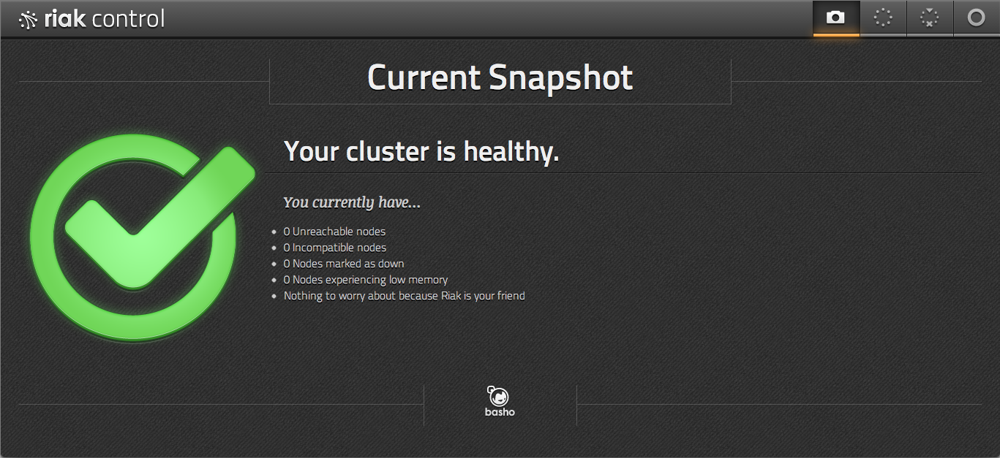
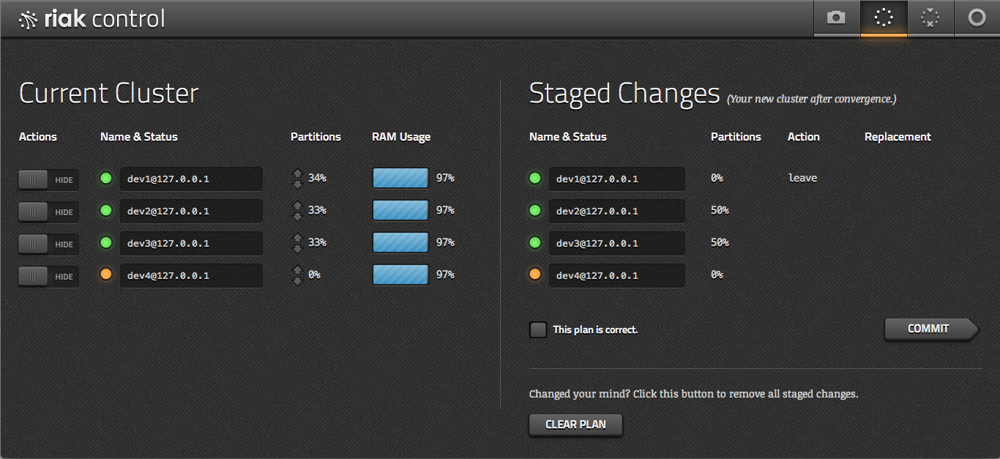

## Tools

### Riaknostic

You may recall that we skipped the `diag` command while looking through
`riak-admin`, but it's time to circle back around.

[Riaknostic](http://riaknostic.basho.com/) is a diagnostic tool
for Riak, meant to run a suite of checks against an installation to
discover potential problems. If it finds any, it also recommends
potential resolutions.

Riaknostic exists separately from the core project but as of Riak 1.3
is included and installed with the standard database packages.

```bash
$ riak-admin diag --list
Available diagnostic checks:

  disk                 Data directory permissions and atime
  dumps                Find crash dumps
  memory_use           Measure memory usage
  nodes_connected      Cluster node liveness
  ring_membership      Cluster membership validity
  ring_preflists       Check ring satisfies n_val
  ring_size            Ring size valid
  search               Check whether search is enabled on all nodes
```

I'm a bit concerned that my disk might be slow, so I ran the `disk` diagnostic.

```bash
$ riak-admin diag disk
21:52:47.353 [notice] Data directory /riak/data/bitcask is\
not mounted with 'noatime'. Please remount its disk with the\
'noatime' flag to improve performance.
```

Riaknostic returns an analysis and suggestion for improvement. Had my disk
configuration been ok, the command would have returned nothing.


### Riak Control

The last tool we'll look at is the aptly named
[Riak Control](http://docs.basho.com/riak/latest/ops/advanced/riak-control/).
It's a web application for managing Riak clusters, watching, and drilling down
into the details of your nodes to get a comprehensive view of the system. That's the
idea, anyway. It's forever a work in progress, and it does not yet have parity with
all of the command-line tools we've looked at. However, it's great for quick
checkups and routing configuration changes.

Riak Control is shipped with Riak as of version 1.1, but turned off by
default. You can enable it on one of your servers by editing
`riak.conf` and restarting the node.

If you're going to turn it on in production, do so carefully: you're
opening up your cluster to remote administration using a password that
sadly must be stored in plain text in the configuration file.

The first step is to enable SSL and HTTPS in the `riak_core` section
of `riak.conf`.  You can just uncomment these lines, set the `https`
port to a reasonable value like `8069`, and point the `certfile` and
`keyfile` to your SSL certificate. If you have an intermediate
authority, add the `cacertfile` too.

```bash
## listener.https.<name> is an IP address and TCP port that the Riak
## HTTPS interface will bind.
## 
## Acceptable values:
##   - an IP/port pair, e.g. 127.0.0.1:8069
listener.https.internal = 127.0.0.1:8069

## Default cert location for https can be overridden
## with the ssl config variable, for example:
## 
## Acceptable values:
##   - the path to a file
ssl.certfile = $(platform_etc_dir)/cert.pem

## Default key location for https can be overridden with the ssl
## config variable, for example:
## 
## Acceptable values:
##   - the path to a file
ssl.keyfile = $(platform_etc_dir)/key.pem

## Default signing authority location for https can be overridden
## with the ssl config variable, for example:
## 
## Acceptable values:
##   - the path to a file
ssl.cacertfile = $(platform_etc_dir)/cacertfile.pem
```

Then, you'll have to `enable` Riak Control in your `riak.conf`, and add a user.
Note that the user password is plain text. Yeah it sucks, so be careful to not
open your Control web access to the rest of the world, or you risk giving away
the keys to the kingdom.

```bash
## Set to 'off' to disable the admin panel.
## 
## Default: off
## 
## Acceptable values:
##   - on or off
riak_control = on

## Authentication mode used for access to the admin panel.
## 
## Default: off
## 
## Acceptable values:
##   - one of: off, userlist
riak_control.auth.mode = on

## If riak control's authentication mode (riak_control.auth.mode)
## is set to 'userlist' then this is the list of usernames and
## passwords for access to the admin panel.
## To create users with given names, add entries of the format:
## riak_control.auth.user.USERNAME.password = PASSWORD
## replacing USERNAME with the desired username and PASSWORD with the
## desired password for that user.
## 
## Acceptable values:
##   - text
riak_control.auth.user.admin.password = lovesecretsexgod
```



With Control in place, restart your node and connect via a browser (note you're using
`https`) `https://localhost:8069/admin`. After you log in using the user you set, you
should see a snapshot page, which communicates the health of your cluster.

If something is wrong, you'll see a huge red "X" instead of the green check mark, along
with a list of what the trouble is.

From here you can drill down into a view of the cluster's nodes, with details on memory usage, partition distribution, and other status. You can also add and configure these nodes, then view the plan and status of those changes.



There is more in line for Riak Control, like performing MapReduce queries, stats views,
graphs, and more coming down the pipe. It's not a universal toolkit quite yet,
but it has a phenomenal start.

Once your cluster is to your liking, you can manage individual nodes, either stopping or taking them down permanently. You can also find a more detailed view of an individual node, such as what percentage of the cluster it manages, or its RAM usage.


<!-- ## Scaling Riak
Vertically (by adding bigger hardware), and Horizontally (by adding more nodes).
 -->
